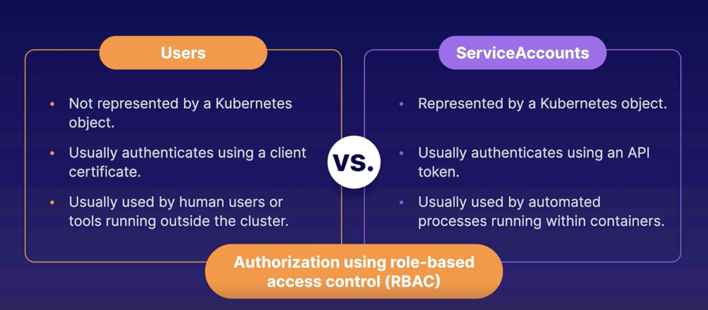

### application-environment-configuration-security

#### Custom Resource Definitions (CRDs)
An extension to Kubernetes API. These are defined through CRDs and controlled through custom controllers.

#### Service Accounts
- A service account allow processes within the containers to authenticate with kubernetes API server. So, if any process within a container wants to interact with k8s api server (performing any action on k8s cluster), they can use service accounts.
- Service accounts work with RBAC (Role Based Access control) to define the permissions.
- Every pod by default gets a `default` service account.

#### Kubernetes Auth
Kubernetes have two kinds of users to be authenticated or authorized.
- Users
- Service Accounts

#### RBAC 
It is a system for managing authorization. This allows us to define what users are allowed to do within the k8s cluster.
- Role - To define the permissions [verbs (list, get) and resources (pods, services)]. It is namespaced. We can create cluster roles which will be cluster-scoped
- Role Binding - This object binds a service account, user or group to a role.

